# SmartBed AI 🏥⚕️
*National Hackathon Submission*

**Team CERES:**
- Nihal DR
- Devesh Reddy 
- M Tanusree Reddy

**SmartBed AI** solves the NP-Hard logistical nightmare of dynamic hospital bed allocation using AI optimization. It eliminates legacy whiteboard workflows by matching incoming patients with the right bed instantaneously, saving money, saving time, and ultimately: saving lives.

## ✨ Core Features & Technical Achievements

### 1. 🧠 Optimization Engine: Mixed-Integer Linear Programming (MILP)
The system's "Global Optimization" feature is powered by the open-source `PuLP` optimization library. Under the hood, it calculates thousands of permutations in seconds to allocate patients from the Emergency Department queue into available hospital beds. 
- **Objective:** Maximize aggregate patient survival probabilities while minimizing wait times.
- **Constraints:** Bed exclusivity, ward exclusivity, Acuity-level restrictions (e.g. Red triage patients cannot be assigned to General step-down beds).

### 2. 📈 Predictive AI: AutoRegressive Integrated Moving Average (ARIMA)
The `Predictions View` is completely powered by a real `statsmodels` ARIMA machine learning algorithm running in the Python backend.
- **Data:** Trained dynamically on 60-days of generated historical tabular data (including modeled weekly seasonality).
- **Proactive Insights:** The UI displays 7-day predictive inflows, complete with upper/lower bounds representing 95% Confidence Intervals, allowing administrators to forecast weekend surges.

### 3. 🤔 What-If Edge Simulator (Monte Carlo)
Hospital administrators need to prepare for Mass Casualty Incidents (MCIs) and Flu Surges. 
The Event-Driven Simulator takes dynamic user input—such as staffing limits, baseline inflow multipliers, and average patient acuity modifiers—and immediately runs an intensive simulation to output 72-hour bottleneck projections.

### 4. ⚡ Real-Time Reactivity (Full-Stack)
- **FastAPI Backend:** Fully asynchronous backend API providing robust routing and data validation via Pydantic.
- **WebSockets connection:** The `Dashboard` view connects to an active WebSocket, which continuously streams live hospital KPI updates directly to the client UI (such as the actual count of critical patients). No manual refreshes required.
- **SQLite Database:** Powered by SQLAlchemy ORM, containing fully populated tables for Users, Patients, Wards, Beds, and System Alerts.
- **Authentication:** Fully robust JWT security. Demo allows simple click-to-login access switching instantly between Administrator, Triage Nurse, and Bed Manager roles.

### 5. 🎨 Stunning Front-End UI
- Built using **React + TypeScript + Vite**.
- Extreme emphasis on visual excellence using custom **Glassmorphism**, floating layout grids, custom gradient animations, and curated **Tailwind CSS**.
- Charts implemented using **Recharts** with interactive tooltips and beautiful gradient area strokes.

## 🔄 User Flow Diagram

```mermaid
graph TD
    %% Styling Settings
    classDef auth fill:#1e293b,stroke:#4f46e5,stroke-width:2px,color:#fff,rx:8px,ry:8px;
    classDef views fill:#0f172a,stroke:#64748b,stroke-width:1px,color:#fff,rx:8px,ry:8px;
    classDef actions fill:#1e1b4b,stroke:#818cf8,stroke-width:1px,color:#fff;
    classDef ai fill:#312e81,stroke:#a5b4fc,stroke-width:2px,color:#fff,rx:20px,ry:20px;

    %% Nodes
    Login("Login Screen<br/>(Role Selection)"):::auth
    
    Dash("📊 Live Dashboard<br/>(WebSockets + KPIs)"):::views
    Triage("🏥 Triage & Allocation<br/>(Patient Queue)"):::views
    Predict("📉 AI Predictions<br/>(Time-Series Forecasting)"):::views
    SimView("🧪 What-If Simulator<br/>(Stress Testing)"):::views
    
    CallMILP["Run MILP Allocation Engine<br/>(PuLP)"]:::actions
    AssignBed["Auto-Assign Beds & <br/>Route Patients"]:::actions
    CallARIMA["Analyze 60-Day History<br/>(ARIMA Model)"]:::actions
    CallSim["Run Monte Carlo<br/>Disaster Projections"]:::actions

    %% Connections
    Login -->|"Authenticate (JWT)"| Dash
    
    Dash -->|"Navigate Sidebar"| Triage
    Dash -->|"Navigate Sidebar"| Predict
    Dash -->|"Navigate Sidebar"| SimView

    Triage -->|"Request Global Optimization"| CallMILP
    CallMILP -->|"Solve NP-Hard Constraints"| AssignBed
    AssignBed -.->|"Update Live State"| Dash

    Predict -->|"Trigger Forecast"| CallARIMA
    CallARIMA -->|"Display 7-Day Surge Bounds"| Predict

    SimView -->|"Configure Mass-Casualty Parameters"| CallSim
    CallSim -->|"Display 72-Hour Bottlenecks"| SimView
```



---

## 🏗️ System Architecture & Stack

- **Frontend**: React + TypeScript + Tailwind CSS (Vite)
- **Backend API**: Python FastAPI
- **Database**: SQLite (SQLAlchemy ORM)
- **Real-Time**: FastAPI WebSockets
- **Optimization Engine**: PuLP (MILP Solver using CBC backend)
- **Forecasting**: statsmodels (`ARIMA` algorithm)

### Database Schema (SQLAlchemy)
- `User`: Roles (admin, nurse, manager) with bcrypt hashed passwords.
- `Patient`: Stores triage_level, acuity_score, wait_time.
- `Ward` & `Bed`: Track real-time unit availability.
- `Alert`: Real-time system notifications pushed to UI.

### File Structure Overview
```text
├── backend/
│   ├── main.py              # FastAPI entry point
│   ├── database.py          # SQLite setup
│   ├── models.py            # SQLAlchemy schemas
│   ├── seed.py              # Mock data generator
│   ├── engine/              # ML Models (ARIMA, MILP)
│   └── routers/             # API Endpoints (Auth, Dashboard, Allocator, WebSockets)
└── src/                     # React Frontend
    ├── components/
    │   └── views/           # Main UI sections (Dashboard, Triage, etc)
    ├── App.tsx              # Main wrapper + Sidebar + Dark Mode Layout
    └── index.css            # Tailwind + Glassmorphism Custom Variables
```

---

## 🚀 How to Run Locally

### 1. Database Setup
The SQLite database configures itself automatically, but you should run the seeder script first to populate the dummy data (over 500 records of beds, history, and patients).
```bash
cd backend
python -m venv venv
.\venv\Scripts\activate  # On Windows
pip install -r requirements.txt
python -m seed
```

### 2. Start the Backend API (FastAPI)
Leaving that same terminal window open:
```bash
uvicorn main:app --reload --port 8000
```
> The API will be available at `http://localhost:8000`. You can optionally view the auto-generated Swagger docs at `http://localhost:8000/docs`.

### 3. Start the Frontend Application (Vite/React)
In a separate, new terminal window at the project root folder:
```bash
npm install
npm run dev
```

### 4. Access the Application
Open Google Chrome or Firefox and navigate to `http://localhost:5173` (or whatever port Vite binds to locally).

To log in, simply click on the incredibly convenient "Demo Account" buttons at the bottom of the login screen (Admin, Nurse, Manager)!

---

## 📖 Hackathon Pitch Script
If presenting this project, we have provided an extremely carefully curated flow script to guarantee maximum impact in exactly 3 minutes.
Please refer to `DEMO.md` in the root of the repository!
